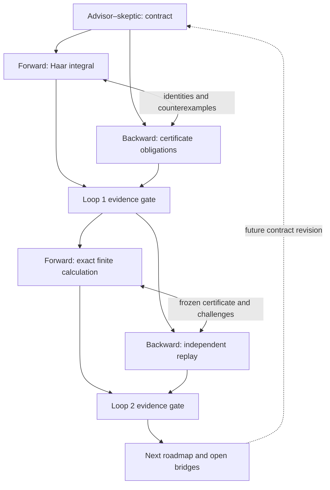

# Three-person, two-loop research protocol

The working team has exactly three research roles. The advisor also acts as skeptic; the other two researchers derive forward from the existing model and backward from the desired conclusion. The two workers may exchange equations and objections directly. The advisor owns acceptance, the shared contract, the dependency graph and final integration. This is a recorded collaboration protocol, not a continuously running swarm or a promise to exhaust every possible mathematical argument.

## Starting evidence and target selection

The starting snapshot is repository commit `64b726add0691a04d72bd0c9b2a3c6e6b15fe755`. Round13 supplies exact one-loop moment certificates, a regular scalar coupling-response identity, fixed-spacing local dynamics and an application of a known product-vacuum stability theorem in a sufficiently small static magnetic/electric regime. Its numerical stability threshold remains unevaluated. The ordinary two adjacent open planar Wilson squares are an exact Euclidean factorization baseline after maximal-tree gauge fixing.

The selected finite research target is to introduce an explicit bounded mixed-loop term, derive its effect without factorizing it away, and certify at least one genuinely nonfactorized observable. This advances the finite loop-integral and verification machinery. It does not identify this deformed finite Euclidean state with a Yang–Mills Hamiltonian vacuum. The full four-dimensional existence and mass-gap target remains the outer backward goal, with its missing premises visible.

The explicit stability-constant problem remains a separate spectral priority. The current research loop will audit that route's constants and state matching, but it will not invent a threshold in order to call the finite experiments part of its admissible regime.

## Shared mathematical contract

Use normalized Haar probability on `SU(2) × SU(2)` and define

\[
x=\tfrac12\operatorname{Tr}U,\quad
y=\tfrac12\operatorname{Tr}V,\quad
z=\tfrac12\operatorname{Tr}(UV).
\]

The orbit coordinates obey

\[
|x|,|y|\le1,\qquad (z-xy)^2\le(1-x^2)(1-y^2).
\]

The probability family is

\[
d\mu_{k_1,k_2,\eta}=Z^{-1}
e^{k_1x+k_2y+\eta z}\,dU\,dV,
\qquad k_1,k_2,\eta\in\mathbb R.
\]

These couplings are dimensionless Euclidean coefficients. The parameter `eta` changes the finite action. It is not a guessed physical mass, a representation cutoff or physical time. Its removal at `eta=0` is exact and returns the stated factorized finite action. That removal alone is not a continuum universality theorem.

The observables are the means of `x,y,z`, their second moments, and `Cov(x,y)`. A numerical quadrature order, Taylor degree and rational precision are algorithmic variables and must not be substituted for lattice spacing, physical volume or a bare-coupling trajectory.

## Roles and file ownership

| Role | Direction and responsibility | Required challenge | Owned outputs |
|---|---|---|---|
| Advisor–skeptic | Select the target, freeze its action/state, reject unsupported implications, review both implementations and integrate the evidence | Look for a changed measure, hidden infinite-order premise, uncontrolled remainder, missing normalization, and a static-correlation-to-gap shortcut | Protocol, acceptance, feedback ledger, graph, roadmap, website and publication |
| Forward researcher | Derive consequences of the declared Haar integral; implement a stable reduction and then the accepted certificate method | Compare a reduced representation with direct angular integration; test cancellation and exactly factorized limits | Forward derivations, numerical model, producer certificates and raw outputs |
| Backward researcher | Start from a certified observable and the outer mass-gap target; expose every needed premise | Independently reconstruct Haar integrals and certificate arithmetic without importing the forward evaluator | Character oracle, backward obligations, independent checks and route replay |

Only the owner edits a working file. Reviewers may read it and send counterexamples. A changed scientific source invalidates its earlier acceptance hash. The advisor must not describe an author's self-test as an independent result. Mathematical assumptions shared by both calculations remain shared even when their implementations differ.

## Loop one: formulation, derivation and falsification

1. **Freeze the target and hypotheses.** State the exact finite measure, observable, parameter domain and known `eta=0` result. Register the proposed claims before choosing favorable numerical examples.
2. **Forward derivation.** Integrate one SU(2) variable conditionally. Derive the normalization and all first and second moments required for covariance. Treat zero effective field with removable limits rather than division. Test whether the result remains regular when nonzero coefficients cancel.
3. **Backward derivation.** Determine the data needed for a rigorous normalized covariance interval: an exact Haar moment functional, a positive partition enclosure, bounded numerator remainders and interval arithmetic including products. Derive the Haar functional through characters and Schur orthogonality independently of the quaternion-coordinate formula.
4. **Cross-examination.** Exchange exact identities, parameter transformations and proposed false claims. Compare the direct angular integral with the reduced integral and characterize any discrepancy under separate quadrature refinement. Do not accept a small residual unless a deliberately wrong model is rejected by the same check.
5. **Advisor gate.** Promote only claims with a complete conventional derivation and compatible implementations. Preserve a failed test, changed assumption or access limitation. A floating agreement is accepted as a numerical comparison, not a rigorous interval.
6. **Feedback into loop two.** Select the remaining highest-value calculational gap. The anticipated gap is a total error enclosure for a nonfactorized finite-coupling observable. The next target may be narrowed if the exact moment or denominator argument fails.

### Loop-one hypotheses

- **H1:** the ordinary `eta=0` two-square measure factorizes exactly. It must pass at nonzero `k1,k2`, not only at zero coupling.
- **H2:** the mixed-loop family admits an exact one-dimensional conditional reduction with a removable zero-effective-field limit. Any omitted normalization or changed product orientation rejects this claim.
- **H3:** the mixed response at `eta=0` can be derived from the same probability family, rather than fitted as an arbitrary constant. In particular, test the proposed relation `d_eta Cov(x,y)|0 = Var_k1(x) Var_k2(y)`.
- **H4:** the `k1=k2=0` slice supplies an exactly solvable nonfactorized exception. Test it by an independent group change of variables, not solely by agreement of numerical routines.
- **H5:** finite static covariance alone implies a physical mass gap. This is an adversarial hypothesis expected to fail because it supplies neither a physical time generator nor the continuum reconstruction data.

## Loop two: certified calculation and independent replay

Loop two starts only after the first advisor gate and records which feedback changed the work. Its purpose is to turn the accepted finite-model identities into rigorously bounded computed quantities.

1. **Choose rational fixtures.** Include zero deformation, a solvable nonzero deformation, a genuinely mixed three-coefficient case, signed coefficients and an intentionally insufficient truncation. Do not silently replace a failed accuracy target with a looser one.
2. **Forward computation.** Expand a bounded exponential with exact rational polynomial coefficients and derive an explicit uniform remainder. Compute the partition and all needed numerators from exact Haar moments. Divide intervals only after proving the partition lower endpoint is positive. A covariance interval must retain the error in both means and their product.
3. **Backward reconstruction.** Rebuild every moment using the independent character oracle; reconstruct the observable interval from the declared parameters, degree and remainder. Do not trust serialized endpoints or import the producer's interval routine as the verifier.
4. **Exceptions and attack cases.** Test `eta=0`, parameter swaps, sign symmetries, a zero effective field, a zero-action exponential, malformed rational input, Boolean-as-integer substitutions, missing moment terms, dropped denominator errors and altered source/certificate bytes. The deliberately inadequate degree must remain inadequate.
5. **Actual two-front search.** Use reviewed implications with explicit action/state/observable domains. Retain a forward/backward meeting and separately replay the ordered certificate. Withdrawing the exact moment identity, positive denominator, remainder or matched state must block the corresponding route. The full four-dimensional goal must stay unproved when its premises are absent.
6. **Second advisor gate.** Reconcile numerical comparisons, exact intervals and the physical scope. Mark passed, rejected, insufficient and blocked claims separately. Stop this requested two-loop run after publication of the second feedback decision; propose the next loop with bounded acceptance conditions.

## Collaboration graph

The graph expresses responsibilities and dependencies. The website uses the executed ledger to distinguish completed work from planned edges. Arrows are not assertions that the final problem is solved.

## Outer backward requirements

A full mass-gap claim must specify the intended pure gauge group and dimension, construct a nontrivial continuum theory meeting the required axioms, identify its physical vacuum and generator, and prove a positive physical spectral threshold in that theory. The presently inspected lattice stability theorem is conditional on a small static magnetic/electric ratio at fixed spacing. A finite deformed Euclidean loop integral supplies none of those matching or regulator-limit steps by itself. The source-specific obstacles and candidate next experiments must remain beside the successful finite calculation.

The stopping criterion is two completed and audited research loops, not an assertion that all possible routes have been exhausted or the Millennium problem has been solved. A valid counterexample changes the hypothesis and the next loop; it is not an obstacle to be hidden.
