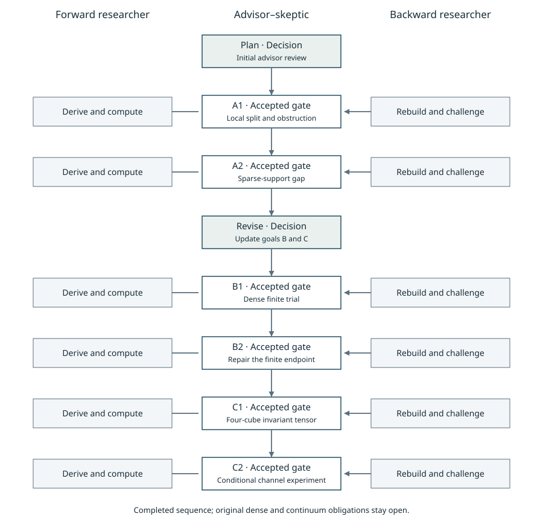
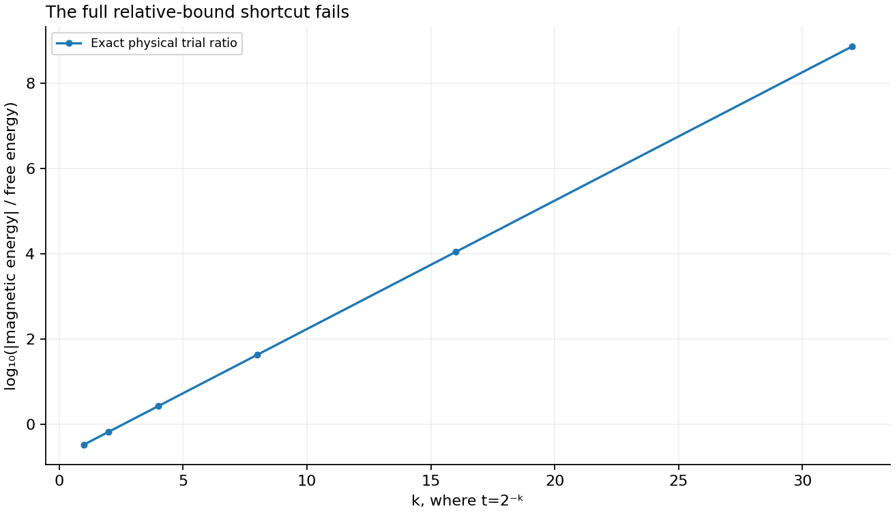
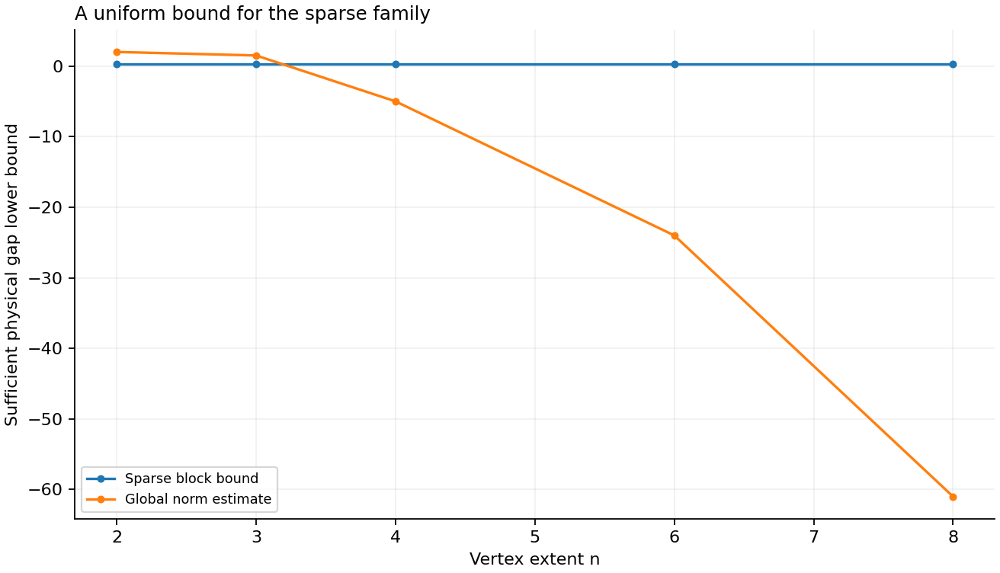
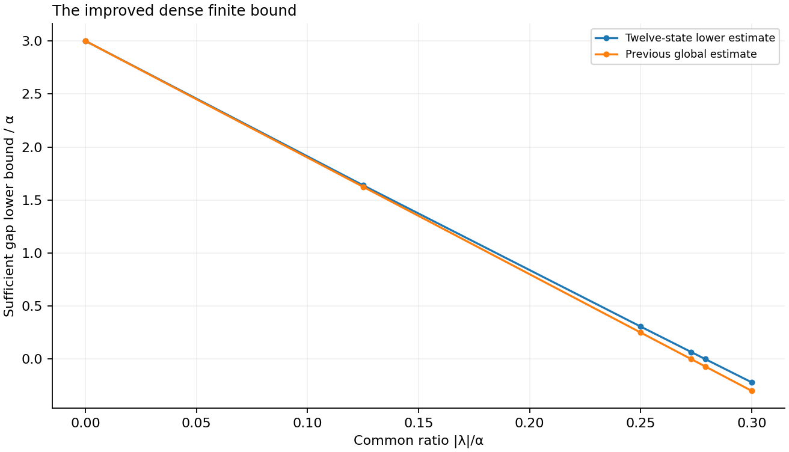
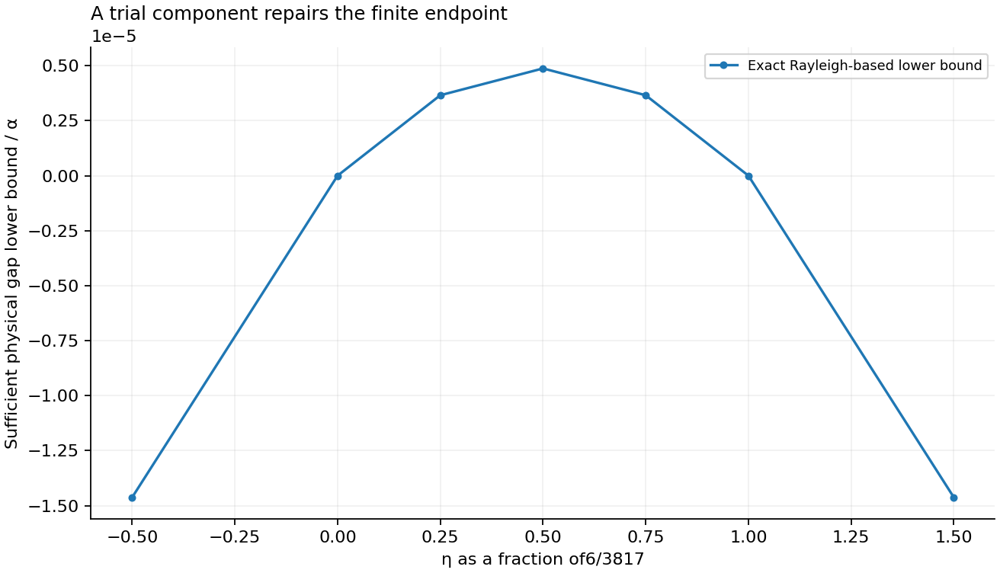
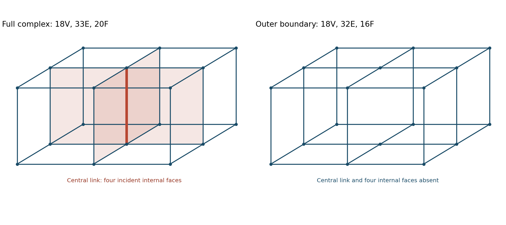
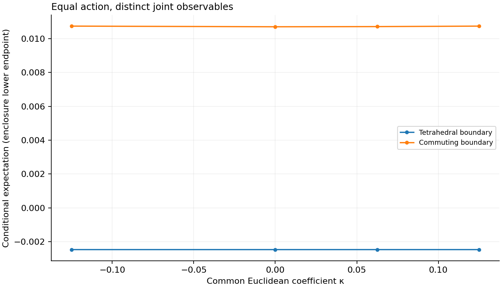
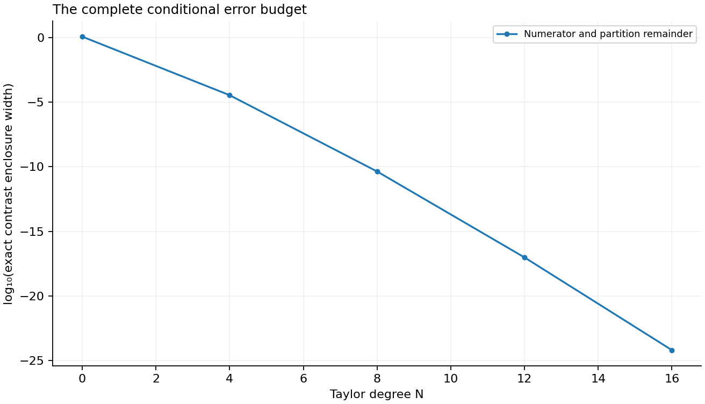

# Yang–Mills: six-loop research dossier

[Published workbench](https://occult-kranti.github.io/yang_mills_workbench/#research) · [Source repository](https://github.com/occult-kranti/yang_mills_workbench)

Three scientific roles; six sequential loops; two advisory decisions. The second planning decision updated B and C from the completed A1/A2 results. All eight collaboration stages are recorded. This is a set of reviewed conventional finite results, not a claimed solution of the four-dimensional continuum mass-gap problem.

Six sequential loops examine three precise mathematical goals. They separate a restricted uniform gap theorem, improved finite spectral estimates, and a conditional invariant-tensor calculation from the unresolved dense lattice and continuum problem.

An explicit quantitative bound for dense overlapping interactions remains missing. The conditional central-link result still needs the surrounding bulk integration. A matched physical time generator, controlled volume and lattice-spacing limits, continuum reconstruction and the four-dimensional Yang–Mills mass gap remain unresolved.

## Evidence and scope

| Loop | Producer checks | Independent checks | Separate comparison checks |
|---|---:|---:|---:|
| A1 | 65 | 97 | 22 |
| A2 | 42 | 28 | 14 |
| B1 | 32 | 23 | 14 |
| B2 | 38 | 25 | 20 |
| C1 | 34 | 34 | 14 |
| C2 | 44 | 36 | 22 |

Normal and optimized executions repeat the same named gates and are counted once. Agreement between two algorithms is paired with their written derivations and discriminating controls. These are agent reviews, not credentialed human peer review.

The Hamiltonian is H=αΣC_e−Σλ_p x_p on the full, untruncated, physical SU(2) link space of the specified finite open graph, with normalized Haar, Casimirj(j+1), all-vertex Gauss law and no external charges. α andλ are energies. Conditional Euclidean coefficientsκ belong to a separately declared static measure.

## Collaboration graph



## A1 — The local estimate and its obstruction

A useful part of the magnetic interaction has a bound independent of the lattice volume. The remaining part mixes the vacuum with an excited loop. An exact physical trial shows why that mixing cannot satisfy the same pure relative bound.

```text
P_p x_p P_p=0, ‖Q_p x_p P_p‖=1/2, Q_p=1−P_p
|⟨Σ_p λ_p Q_p x_p Q_p⟩| ≤ (16/3) max|λ_p| ⟨Σ_e C_e⟩
ψ_t=(Ω+tχ_p)/√(1+t²) ⇒ |⟨V⟩|/⟨H₀⟩=|λ_p|/(3α|t|) → ∞
```

**Scope:** The diagonal bound is proved. The proposed extension to the full perturbation is disproved for nonzero coupling. Neither statement says the physical gap closes.

### Derive the operator split

Each link has normalized SU(2) Haar measure. P_p projects the four plaquette links onto constants and acts as the identity elsewhere. Haar mean zero gives P_p x_p P_p=0, while the second moment1/4 gives the exact vacuum-to-excitation norm1/2. Inserting P_p+Q_p on both sides leaves a diagonal term and two offdiagonal terms. The split holds on the full link space and preserves the Gauss sector.

```text
x_p=Q_p x_p Q_p+P_p x_p Q_p+Q_p x_p P_p
```

### Account for every shared link

The commuting link-vacuum projections give a union bound for Q_p. Every nontrivial link representation has Casimir at least3/4, and an open cubic link touches at most four plaquettes. These facts give16/3. The corresponding overlap count is at most twelve other plaquettes, or thirteen including the plaquette itself. The physical square excitation3α must not replace the unprojected link gap3α/4 in this local inequality.

```text
Q_p ≤ Σ_(e∈p)(1−P_e) ≤ (4/3)Σ_(e∈p)C_e
```

### A physical counterexample, not just a matrix test

The vacuum and a fundamental square character are both gauge invariant. Their normalized superposition has free energy quadratic in t and magnetic energy linear in t. Taking t toward zero defeats every finite pure relative constant. At t=0 the quotient is undefined; at zero coupling it is zero away from the origin. Bounds with an additive energy term and suitable local stability theorems are still possible.

```text
⟨H₀⟩=3αt²/(1+t²),  ⟨V⟩=−λ_p t/(1+t²)
```



### Skeptical review

The verifier independently used Haar recurrences, actual coordinate graphs, exact noncommuting SU(2) matrices and a physical trial. A Boolean-coordinate validation defect was reproduced and repaired; its original passing run and failure record remain available. The source audit also rejects transferring a qubit/two-site numerical constant to four-link rotors.

**Feedback:** The failed shortcut selected A2: retain the Hamiltonian and test a link-disjoint support family whose blocks can be bounded directly.

[Frozen contract](advisor/a1-contract.md) · [Forward derivation](forward/a1/report.md) · [Independent derivation](backward/a1/report.md) · [Accepted source inventory](advisor/a1-gate.json)

## A2 — A uniform gap for a sparse interaction family

On the original full lattice, turn on magnetic terms only for plaquettes whose link sets do not overlap. Their number can grow proportionally to the lattice volume. A block argument gives an explicit positive physical gap bound that stays fixed as the lattice grows.

```text
max_p|λ_p|/α ≤ ρ < 3/4,  α ≥ α_min > 0
Δ_physical ≥ α_min(3/4−ρ)
At ρ=1/2 and α_min=1: Δ_physical ≥ 1/4
```

**Scope:** This theorem covers pairwise link-disjoint nonzero interactions. Shared vertices are allowed. Adding even a weak nonzero interaction on a shared link leaves this proof's scope; it does not establish gap closure.

### Keep the full graph and the correct Hilbert space

Every original link and electric term remains present. The support mask sets selected existing magnetic coefficients to zero. The unprojected link Hilbert space factors into four-link interacting blocks and free links. The physical gauge-invariant space is not assumed to factorize. Compactness of the group and boundedness of the potential supply self-adjoint block operators with compact resolvent.

### Prove a block bound and include the physical ground

A block's free first excitation costs3α/4. Min–max bounds its second eigenvalue below by3α/4−|λ_p|, while the constant trial puts its ground energy at most zero. This proves a unique ground for the stated coupling range. Each block ground transforms in a one-dimensional continuous representation of its endpoint SU(2) groups; those representations are trivial. The product ground therefore satisfies global Gauss law even when blocks share vertices. Restricting to the physical sector retains that ground and cannot lower its excitation threshold.

```text
E₁(block) ≥ 3α/4−|λ_p|,  E₀(block) ≤ 0
Δ(block) ≥ 3α/4−|λ_p|
```

### An extensive mask, with exact boundary cases

Choose xy squares at even x and even y in every z layer. An n-by-n-by-n vertex box then has n floor(n/2)² active plaquettes. The arbitrary-size combinatorial argument proves disjointness; finite samples check the implementation. The global norm estimate deteriorates with this active count, while the separate block bound stays positive. Atρ=3/4 the block estimate is insufficient, not a measurement of zero gap. The common energy prefactor is essential to the stated uniform inference.

```text
N_active(n)=n⌊n/2⌋²
Global sufficient bound: 3α−Σ_p|λ_p|
```



### Skeptical review

The independent implementation reconstructs supports and block/free partitions from coordinates. It accepts corner sharing and zero coefficients, rejects a nonzero overlapping bridge, and checks signed couplings and energy scales. An unbounded materialization helper was capped without limiting the arbitrary-size count formula or lazy generator.

**Feedback:** This result revised both remaining goals. B now tests the dense eleven-face graph with its own physical spectral argument. C must demonstrate the new tensor channels on its actual graph.

[Frozen contract](advisor/a2-contract.md) · [Forward derivation](forward/a2/report.md) · [Independent derivation](backward/a2/report.md) · [Accepted source inventory](advisor/a2-gate.json)

## B1 — A physical trial on the dense two-cube graph

The vacuum and eleven fundamental plaquette states give a better variational estimate of the ground energy. Combining it with a separate bound on the full operator's first excited energy proves a stronger finite physical gap inequality.

```text
δ=3α,  L=Σ_p|λ_p|,  Q=Σ_p λ_p²
E₀ ≤ (δ−√(δ²+Q))/2,  E₁ ≥ δ−L
Δ_physical ≥ (δ+√(δ²+Q))/2−L
Equal magnitudes: sufficient positivity for |λ|/α < 12/43
```

**Scope:** This is the full untruncated physical operator on one dense finite graph. The bracket encloses the sufficient lower-bound expression; its upper endpoint is not an upper bound on the physical gap.

### Rebuild all trial entries

The actual complex has twelve vertices, twenty links and eleven faces, including the shared face once. Character orthogonality and link-center parity give an identity Gram matrix for the vacuum and eleven fundamental characters. Repeated indices are counted before applying parity. Both researchers check all144 Gram entries and1,584 individual magnetic insertion entries. Every fundamental loop has electric energy3α; the only magnetic entries connect the vacuum to a face state.

```text
G=I₁₂,  H₀=diag(0,3α,…,3α)
⟨Ω,Vχ_p⟩=−λ_p/2,  ⟨χ_p,Vχ_q⟩=0
```

### Use the full excited-energy bound

Gauss law forbids a degree-one vertex in nontrivial spin-network support. Such support contains a cycle; this graph has girth four. Four fundamental links attain the free physical gap3α. The magnetic norm is at most L, so min–max gives E₁≥3α−L for the full operator. The trial matrix independently gives an upper bound for E₀. Subtracting in this direction yields a valid gap lower bound; subtracting two trial eigenvalues would not.

### Find the exact sufficient boundary

For equal coupling magnitudes r, the inequality becomes B(r)>0. Squaring is used only after checking the sign of22r−3. The exact threshold is12/43. At the old endpoint3/11 the new lower bound exceeds0.0666989α. At12/43 its radical equals135/43 and the estimate is exactly zero. This records the failure that selects B2; it is not a physical gap-closing result.

```text
B(r)=(3+√(9+11r²))/2−11r
B(r)>0 ⇔ 0≤r<12/43;  B(12/43)=0
```



### Skeptical review

The backward computation uses actual link multiplicities, exact determinant checks and directed rational Newton bounds. These agree with the producer's graph/Haar calculation and dyadic square-root enclosures. Zero, signed unequal, below-threshold, endpoint and insufficient-precision fixtures remain recorded. A2's sparse theorem is explicitly excluded because these face supports overlap.

**Feedback:** B2 keeps the endpoint Hamiltonian fixed and tests one added shared-face adjoint trial component. Its amplitude changes the candidate state, not the theory.

[Frozen contract](advisor/b1-contract.md) · [Forward derivation](forward/b1/report.md) · [Independent derivation](backward/b1/report.md) · [Accepted source inventory](advisor/b1-gate.json)

## B2 — One added representation repairs the finite bound

At the coupling where B1's estimate reached zero, one shared-face adjoint component lowers the trial energy enough to give a strictly positive bound on the full physical gap. The Hamiltonian and its eleven nonzero couplings remain fixed.

```text
λ_p/α=12/43 for all eleven faces;  χ₂(U_s)=4x_s²−1
v_η=Ω+(1/22)Σ_pχ_p+ηχ₂(U_s)
Δ/α ≥ [(6/473)η−(347/43)η²]/[45/44+η²]
η=3/3817 ⇒ Δ ≥ α·1388/284767457 > 0
```

**Scope:** This repairs one sufficient-bound endpoint on a dense finite graph. It supplies neither a dense volume-uniform theorem nor a continuum mass gap. η is a variational amplitude, not a new field or coupling.

### Verify the added character

The ordinary adjoint character has norm one and electric energy8α. It is orthogonal to the previous twelve states. Its only new magnetic matrix entry couples it to the fundamental character on the actual shared face, with value−λ_s/2. The shared face is identified from geometry and incidence. All169 Gram entries and1,859 individual magnetic insertions are checked, including repeated powers.

```text
⟨χ₂²⟩=16⟨x_s⁴⟩−8⟨x_s²⟩+1=1
⟨χ₂,x_sχ₁⟩=8⟨x_s⁴⟩−2⟨x_s²⟩=1/2
```

### Keep both directions of the spectral argument

Atα=1, the full E₁ bound and the old trial eigenvalue are both e=−3/43. The old unnormalized trial has squared norm G=45/44. Adding the adjoint produces an actual Rayleigh quotient R(η), hence E₀≤R(η). Subtracting this upper bound from the separate full E₁ lower bound gives the displayed positive gap estimate.

```text
R(η)=[eG−(6/473)η+8η²]/[G+η²]
E₁−E₀ ≥ e−R(η)
```

### Prove an interval and retain insufficient trials

The numerator factors exactly, so positivity holds throughout the open interval0<η<6/3817. The endpoints give zero estimates and amplitudes outside give negative estimates, while every state remains valid. The selected midpoint maximizes the numerator, not the full quotient; its quotient derivative is slightly negative. No unsupported optimization claim is made. Restoringα multiplies every energy bound byα.

```text
(6/473)η−(347/43)η²=(347/43)η(6/3817−η)
```



### Skeptical review

The independent verifier reconstructs the matrix polynomials and Rayleigh quotient from scratch. An exclusive link proves the required mixed-square moment; parity alone is insufficient for it. Wrong character normalization, omitted mixed terms, wrong electric energy and a trial-gap substitution are discriminating controls. The exact amplitude ledger and scale checks agree between implementations.

**Feedback:** With the finite spectral target completed, C1 moves to the four-cube graph and checks a genuinely larger central invariant space. Its tensor result remains separate from a physical gap theorem.

[Frozen contract](advisor/b2-contract.md) · [Forward derivation](forward/b2/report.md) · [Independent derivation](backward/b2/report.md) · [Accepted source inventory](advisor/b2-gate.json)

## C1 — The full central tensor on four cubes

Four cubes meeting around one link require three invariant channels for four adjoint insertions. Keeping the complete tensor gives a negative joint expectation on a realizable boundary. Removing its cross-channel terms changes the sign.

```text
Full complex: 18 vertices, 33 links, 20 faces
Outer boundary: 18 vertices, 32 links, 16 faces
P=∫R(U)⊗⁴dU=B G⁻¹ Bᵀ, rank P=3
Complete joint expectation: −1/405; diagonal-only replacement: +2/405
```

**Scope:** This integrates one central link with its surrounding links fixed. It is a conditional Haar calculation, not the full twenty-face bulk integral or a Hamiltonian spectral estimate.

### Construct the graph before contracting it

The cells form a2×2×1 box. The central vertical link from(1,1,0) to(1,1,1) touches four faces. Those four faces are internal; the other sixteen form the outer boundary, which has no central link. The two implementations rebuild the signed face words and classify faces by cell incidence. A boundary-only surface is therefore a different complex, not a shorthand for the bulk calculation.

### Derive the complete invariant space

Pairing the four spin-one representations through intermediate spins0,1,2 proves that the invariant space has dimension three. The three Kronecker-delta pairings are not orthonormal. Their Gram matrix has diagonal9 and offdiagonal3, so its inverse has diagonal2/15 and offdiagonal−1/30. The full81×81 operator uses this inverse, including every cross term. Independent exact polynomial Haar integration checks all6,561 entries, self-adjointness, idempotence and infinitesimal rotation invariance.

```text
B₁=δ_abδ_cd, B₂=δ_acδ_bd, B₃=δ_adδ_bc
G=6I+3J, G⁻¹=I/6−J/30
```

### Realize the boundary and test the joint observable

Four three-edge paths outside the central link have disjoint link supports. Actual assignments realize the unit quaternions listed below. Whole face words are reversed when required; changing only one dagger would change the observable. For O=∏χ₂(UH_i)/81, the complete tensor gives−1/405. A diagonal-only replacement gives+2/405 and a single pairing gives+1/729. The product of four individual Haar means is zero. This is a signed observable under a positive measure, so its negative expectation is not a negative probability.

```text
H₁=(1,1,1,1)/2, H₂=(1,1,−1,−1)/2
H₃=(1,−1,1,−1)/2, H₄=(1,−1,−1,1)/2
χ₂(UH)=4[Tr(UH)/2]²−1
```



### Skeptical review

The forward pairing-tensor calculation and independent S³ moment calculation agree exactly. Raw complex matrix multiplication also checks80 actual face words. A real cache bug allowed Boolean exponents and invalid rotation indices after valid cache entries existed. Strict public validation now runs before private caches; the original28-check source and reproduced failure are retained. The corrected34 independent checks and14 focused producer comparisons pass.

**Feedback:** The negative joint result selected C2: keep a nonzero central action and compare two realized boundaries with exactly the same action vector and normalization. Test whether their joint observable still needs the relative boundary directions.

[Frozen contract](advisor/c1-contract.md) · [Forward derivation](forward/c1/report.md) · [Independent derivation](backward/c1/report.md) · [Accepted source inventory](advisor/c1-gate.json)

## C2 — Same action variable, different joint result

A common four-component vector simplifies the central action. It does not retain everything needed for the observable. Two actual boundaries with exactly the same action and normalization give rigorously separated joint expectations at nonzero coupling.

```text
x_i(U)=q·a_i, b=Σ_iκ_i a_i, S(U)=q·b
At κ_i=1/8, both boundaries have b=(1/4,0,0,0)
E_T[O]≈−0.002469114394235138
E_C[O]≈0.01073813525633129
D=E_C[O]−E_T[O]≈0.013207249650566428 > 0
Outward display: D∈[0.013207249650566427, 0.013207249650566428]
```

**Scope:** These are different boundary-dependent integrands of the same four-face functional, under one common central-link measure. The result rejects an action-vector-only observable closure. It does not complete the surrounding bulk integral or a Hamiltonian gap proof.

### Introduce a useful variable with its zero branch

For unit-quaternion U=q, each trace is a real linear form q·a_i. Summing the four action terms gives b=Σκ_i a_i. An orthogonal change of quaternion coordinates preserves normalized S³ Haar and can align nonzero b with an axis, provided the observable directions rotate too. At b=0 use the Haar integral directly. The implemented exact routine accepts scalar-axis and zero-vector actions and rejects unsupported nonaligned inputs; it does not silently approximate a generic rotation.

```text
S(q)=Σ_iκ_i(q·a_i)=q·b
b=0 ⇒ exp S=1; no division by‖b‖
```

### Match the action while changing the boundary geometry

The tetrahedral boundary from C1 and the commuting boundary(I,I,i,−i) both sum to(2,0,0,0). With equalκ their central action is2κq0 and their partition function agrees exactly. Both assignments are realized on the actual four-cube surrounding paths. The normalized observable is the product of four ordinary adjoint characters divided by81. Its tetrahedral and commuting central functions differ because the individual directions differ. The commuting product is nonnegative pointwise; the tetrahedral product can be negative.

```text
O_C(q)=(4q0²−1)²(4q1²−1)²/81
Atκ=0: E[O_T]=−1/405, E[O_C]=13/1215
D(0)=16/1215
```

### Independently reduce the complete observable

The forward program integrates the full polynomial on S³. The independent program first averages the remaining spatial directions on S² at fixedz=q0, then integrates the resulting polynomial against the normalized semicircle density. It reconstructs both displayed polynomials independently. All four individual tetrahedral normalized adjoint polynomials vanish identically, so their individual means are zero for every scalar-axis action, while the joint mean remains nonzero in the tested coupling fixtures.

```text
g_T(z)=(1024z⁸−2752z⁶+2448z⁴−736z²+16)/8505
g_C(z)=(768z⁸−1280z⁶+864z⁴−240z²+23)/1215
E[O]=[∫₋₁¹g(z)e^(2κz)(2/π)√(1−z²) dz]/Z
```

### Bound both numerator and normalization errors

Atκ=1/8 the action magnitude is at most M=1/4. The finite Taylor sums are exact rational numbers. A geometric bound controls the entire omitted exponential tail; the single-observable numerator tail is at mostR_N and the contrast tail at most2R_N. Jensen suppliesZ≥1. Signed interval division retains the denominator uncertainty. Degrees0,4,8 are insufficient for the frozen10⁻¹² width target; degrees12 and16 pass. The degree16 contrast enclosure has width about6.63×10⁻²⁵. Approximate numbers in the headline are display values; the downloadable certificates retain exact rational endpoints.

```text
R_N=M^(N+1)/(N+1)! · [1−M/(N+2)]⁻¹
A∈[A_N−R_N,A_N+R_N]
Z∈[max(1,Z_N−R_N),Z_N+R_N]
```

### Exercise exceptions without changing the inference

The checks retain negative coupling, half coupling, all-zero coefficients, and the commuting caseκ_i=(1/8,−1/8,1/8,1/8), where every coefficient is nonzero butb=0. That last case returns the exact Haar value13/1215. A cache or closure keyed only byb would confuse the two primary boundaries. The relative direction Gram matrices distinguish them. The outer sixteen face terms cancel in this normalized central expectation because they are constant with respect to this link, but still affect the surrounding marginal.





### Skeptical review

The independent angular/radial calculation agrees with every exact numerator coefficient, partition coefficient, boundary assignment and required refinement in the producer collection. Validation checks reject forged collections, missing fixtures, altered normalization and unsupported inputs. Initial lower-level helper checks missed Boolean and negative scalar indices; those actual failures and original sources are retained, and strict helper validation now repairs them. The final gate records the executed check counts.

**Feedback:** The next roadmap keepsb together with the necessary observable geometry, tests a joint-Gram reduction for the declared class of integrals, and then targets a complete surrounding-link integration. Those are planned obligations, not results already supplied by this conditional calculation.

[Frozen contract](advisor/c2-contract.md) · [Forward derivation](forward/c2/report.md) · [Independent derivation](backward/c2/report.md) · [Accepted source inventory](advisor/c2-gate.json)

## Unresolved implications and next cycle

# Next three goals after the six-loop cycle

These are planned obligations, not completed extra loops. The advisor retains three roles and two sequential loops per next goal. Each first loop freezes its second loop only after independent review. The six accepted Round17 loops do not exhaust possible approaches or solve the continuum theory.

## Goal 1: restore overlapping interactions with an explicit local estimate

**Original obligation retained:** obtain a usable numerical small-coupling threshold for the dense finite-volume physical rotor family in one energy convention. A2 solves a sparse exception; it does not discharge this goal.

**Forward first loop:** construct the smallest pair of accepted sparse blocks connected by an actual plaquette bridge. Retain all link electric terms, identify the bridge's Gauss-invariant vacuum/offdiagonal structure, and derive a finite-cluster bound with declared constants. Freeze a bridge-amplitude interval and test zero bridge, signed bridge, corner sharing and link sharing.

**Backward first loop:** start from a desired uniform gap and list the local estimates a rotor-applicable stability theorem requires. Match Hilbert dimension, operator domains, four-link range, overlap degree and ground assumptions against the source. Explain which finite-cluster quantities could enter that theorem. A qubit constant and the norm of the total extensive perturbation do not supply the missing estimate.

**Second loop selection:** if the first loop gives a suitable local control, carry every overlap and combinatorial constant through one complete applicable stability argument. Otherwise record the precise failed hypothesis and derive the required additional local term or dressed-vacuum estimate. The acceptance target is an explicit inequality with all constants and physical units, not a favorable finite-volume spectrum.

**Failure tests:** make the number of nonzero bridges extensive, hold the common lower energy scale fixed, withdraw the local offdiagonal estimate, and try the A1 near-vacuum counterexample. A theorem whose bound silently deteriorates with volume remains insufficient.

## Goal 2: improve the full excited-energy bound on the dense finite graph

**Reason:** B2 improves the ground-energy upper bound enough to repair one endpoint. The separate full E1 lower bound remains crude.

**Forward first loop:** decompose the physical Hilbert space into a declared low-energy trial space and its orthogonal complement. Derive the complement electric threshold, its magnetic norm and the cross-block norm with exact graph and representation multiplicities. Keep the eleven nonzero couplings and α fixed. Choose an H₀-reducing projector, or include the electric cross block explicitly. Prove that every low-energy physical channel is covered before asserting the complement threshold. Do not replace the complement by a finite sampled matrix.

**Backward first loop:** start from a rigorous spectral enclosure for the full E1 and identify the min–max, resolvent or Schur-complement inequality and isolation assumptions required. Independently reconstruct any representation-cutoff tail and certify the denominator signs.

**Second loop selection:** combine the verified full E1 enclosure with an actual Rayleigh E0 upper bound over a predeclared coupling interval. A new interval is accepted only if its entire coverage, endpoints and insufficient cells are independently checked. Trial-state optimization is useful for E0 but does not certify E1 from below.

**Failure tests:** omit a lower physical channel, turn the complement threshold into a sampled value, remove a cross block, and replace the full gap by a Ritz gap. All should be detected on a discriminating fixture. Restore energy units explicitly.

## Goal 3: retain enough geometry for the surrounding integration

**Reason:** the action vector b is a useful conditional variable. Equal b does not identify the boundary-dependent observable. The complete central tensor and the surrounding marginal remain distinct objects.

**Forward first loop:** test a precise stronger closure for the specified class of central observables: retain the joint Gram matrix of b,a1,a2,a3,a4, not just b. Proposed mathematical bridge: equal joint Gram matrices define an isometry between their spans, extensible to an orthogonal transformation of R4; normalized S3 Haar is invariant under that transformation. This should identify integrals of the declared functions of q·b and q·a_i, including rank-deficient and b=0 cases. Require Gram positivity, rank at most four, unit a_i norms and the exact relationb=Σκ_i a_i; keep the central O(4) coordinate change separate from any transformation of the surrounding link measure. This is a proposed conventional proof to check, not an accepted new theorem in this release. It does not cover arbitrary orientation-sensitive insertions without their additional data.

**Backward first loop:** determine exactly which boundary invariants the next surrounding-link integration requires on the actual signed four-cube graph. Shared paths induce constraints; independently distributed Gram entries are not a substitute for induced link Haar measure. Compare two inequivalent boundary realizations and preserve noncommuting order where the observable needs it.

**Second loop selection:** integrate one complete surrounding variable or a predeclared small boundary cluster with all affected face weights and induced observable dependence. Use the remaining conditional integral as an explicit obligation. Expand to the full bulk only when every surrounding link and every face weight has been included with controlled normalization errors.

**Failure tests:** equal b/different Gram, equal valid joint Gram under an explicit rotation, rank deficiency, b=0 with nonzero coefficients, one omitted internal face, and an action-only cache. A local central-link result must fail admission as a full bulk result.

## Continuum target remains downstream

A dense lattice bound, a finite graph improvement and a complete bulk observable are different milestones. A solution to the Clay problem still needs a nontrivial four-dimensional pure Yang–Mills construction, the required reconstruction axioms, a matched physical time generator and a positive spectral scale that survives the relevant limits. No planned premise is admitted as an established fact by the bidirectional planner.


## Source applicability audit

# Primary-source applicability audit — 10 September 2026

This is a targeted follow-up to the Round15–16 source ledger. The following records identify exactly what was checked; they do not claim an exhaustive literature review.

## An explicit number with the wrong hypotheses

[Bravyi, DiVincenzo and Loss, arXiv:0707.1894](https://arxiv.org/pdf/0707.1894), Section1, Theorem1 and Equation5, give ε₀=2⁻¹⁸Δ/(dJ), with a unique ground and gap at least Δ/2 for |ε|≤2ε₀. Their stated model has qubit sites and two-site interactions. Sections2.1–2.3 use one-qubit creation operators and truncate nested perturbation commutators after order4. These hypotheses do not describe our infinite-dimensional link rotors and four-link plaquettes. The number cannot be copied into the workbench as an SU(2) threshold. A replacement proof must control the actual excitation labels, support size, operator domains and contraction constants. Reading depth: setup, theorem and the relevant creation-operator/commutator argument; not a reproduction of every appendix estimate. The retrieved PDF has a 2007 arXiv header and a 2022 typeset date; no publication-date inference is based on the latter.

## A broader theorem without a reconstructed numerical threshold

[Yarotsky, arXiv:math-ph/0411042](https://arxiv.org/pdf/math-ph/0411042), Section1, allows infinite-dimensional sites, an unbounded nonnegative on-site Hamiltonian with a simple gapped vacuum, and bounded finite-range perturbations. Theorems1–3 state small-coupling stability with range-dependent constants c₁,c₂. They support the relevance of the product-vacuum route. A numerical constant for the workbench's link placement and four-link interactions has not been extracted here. This is an outstanding quantitative bridge, not evidence that weak-coupling stability is unknown. Reading depth this round: model, boundary restriction, domains, Theorems1–3; the earlier ledger retains its broader review.

## Prize-problem boundary

The [Clay Mathematics Institute problem page](https://www.claymath.org/millennium/yang-mills-the-maths-gap/) still lists Yang–Mills and the mass gap as unsolved. The official problem concerns a nontrivial quantum Yang–Mills theory on four-dimensional Euclidean space with a positive mass gap. An explicit sparse finite-lattice family, a finite variational inequality or a conditional Haar tensor does not construct that continuum theory.

## Decisions for this cycle

The local operator split is derived directly, with a counterexample to extending its relative bound to the vacuum-offdiagonal term. The sparse-support exception, if accepted, uses a separate min–max/product argument with explicit constants. Its missing overlapping-interaction bridge stays visible. No paper's existential constant is presented as a computed value, and no finite-dimensional truncation is silently substituted for the rotor Hilbert space.


## Reproduction

See [README.md](README.md) for local launch, all eighteen scientific execution/comparison programs, the bidirectional dependency replay and build instructions. Exact rational endpoints and complete failure histories are included. The planner is not a formal proof-assistant kernel.

The standalone scientific figures were reviewed separately. Browser layout and keyboard testing remain unverified. This release reviews new scientific code, required source/data comparisons and affected integration; it does not claim a new line-by-line audit of every historical project file.
