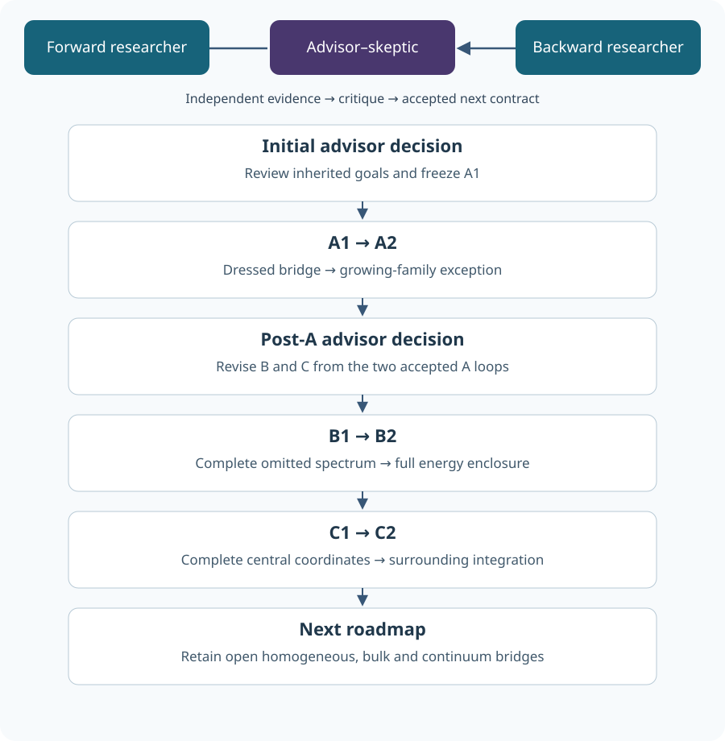
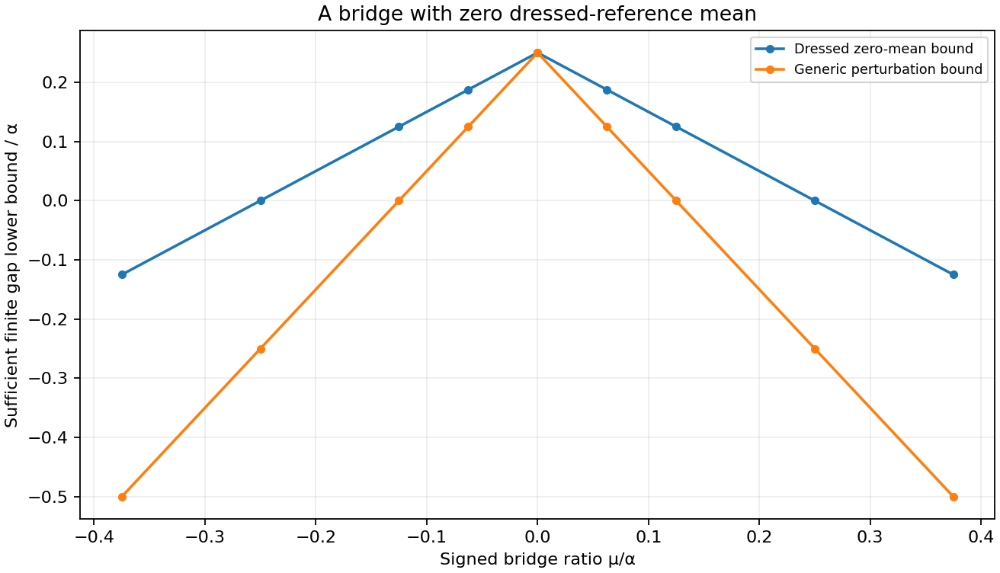
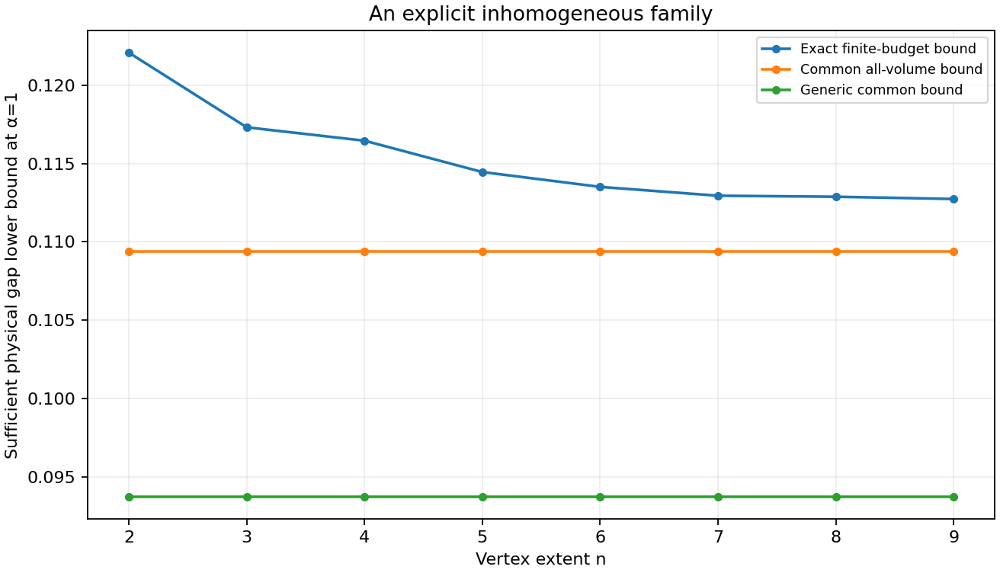
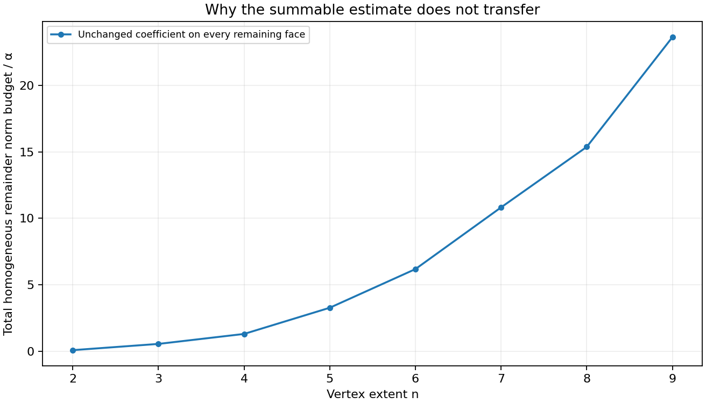
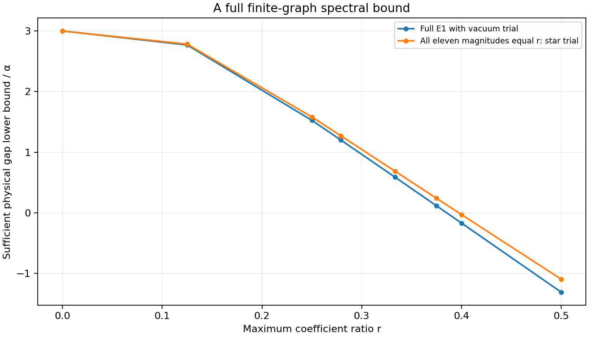
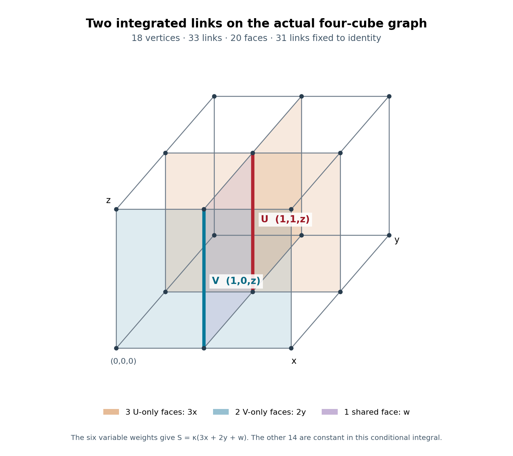
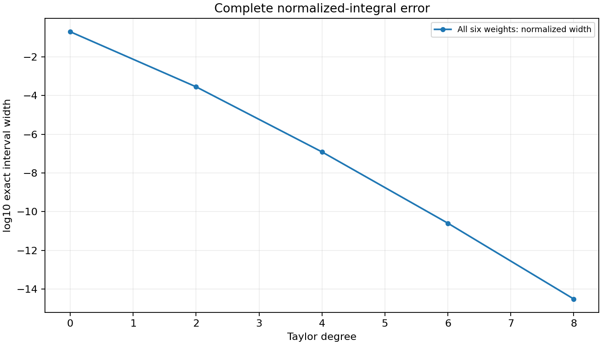
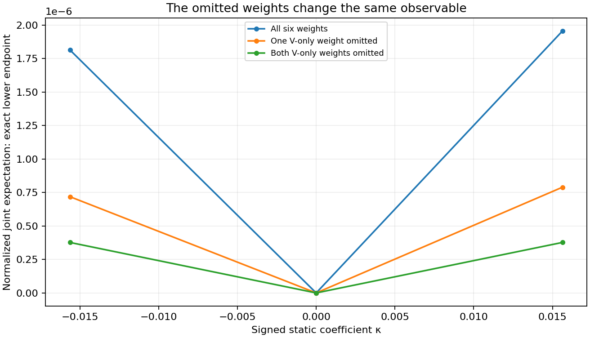

# Yang–Mills: six-loop research dossier

[Published workbench](https://occult-kranti.github.io/yang_mills_workbench/#research) · [Source repository](https://github.com/occult-kranti/yang_mills_workbench)

Three scientific roles; six sequential loops; two advisory decisions. The second planning decision updated B and C from the completed A1/A2 results. All eight collaboration stages are recorded. This is a set of reviewed conventional finite results, not a claimed solution of the four-dimensional continuum mass-gap problem.

Six sequential loops connect dressed finite clusters, a specified growing inhomogeneous family, a stronger full-spectrum finite-graph estimate, complete central observable coordinates and a controlled surrounding-link integral. Each result has its own assumptions, independent challenge and rejected shortcuts.

The homogeneous nondecaying-coupling volume-uniform gap, complete bulk integration, matched physical generator and nontrivial continuum construction remain open. These results do not solve the Clay Yang–Mills existence and mass-gap problem.

## Evidence and scope

| Loop | Producer checks | Independent checks | Separate comparison checks |
|---|---:|---:|---:|
| A1 | 36 | 33 | 27 |
| A2 | 40 | 36 | 32 |
| B1 | 38 | 34 | 27 |
| B2 | 43 | 32 | 28 |
| C1 | 37 | 41 | 31 |
| C2 | 54 | 40 | 39 |

Normal and optimized executions repeat the same named gates and are counted once. Agreement between two algorithms is paired with their written derivations and discriminating controls. These are agent reviews, not credentialed human peer review.

The Hamiltonian is H=αΣC_e−Σλ_p x_p on the full, untruncated, physical SU(2) link space of the specified finite open graph, with normalized Haar, Casimirj(j+1), all-vertex Gauss law and no external charges. α andλ are energies. Conditional Euclidean coefficientsκ belong to a separately declared static measure.

## Collaboration graph



## A1 — A bridge between dressed blocks

A three-square cluster can contain overlapping interactions while retaining a certified physical gap. Integrating an actual free reference link gives the bridge zero mean even when the end-block ground states are dressed and unknown.

```text
Δphysical ≥ α(3/4 − ρ) − |μ| ≥ α/8; ρ ≤ 1/2, |μ| ≤ α/8.
```

**Scope:** Finite eight-vertex, ten-link strip. This is a sufficient gap lower bound on the untruncated operator, not a numerically measured spectrum.

### The reference state matters

The reference includes all electric terms and both end interactions. The end faces have disjoint link supports; the middle face shares one link with each. Its two remaining links have constant free-link factors in the actual dressed reference ground.

### An exact conditional identity

For either untouched link, multiplication and inversion preserve SU(2) Haar measure. The first and second moments hold pointwise in every other link, so they also hold after averaging arbitrary dressed end densities. No bare-vacuum replacement is used.

```text
⟨xmiddle⟩Ψs = 0; ⟨xmiddle²⟩Ψs = 1/4; ||Qs V Ps|| = |μ|/2.
```

### Separate spectral inequalities

Min–max controls the full first excited energy from below. The reference state controls the interacting ground energy from above. A positive difference gives a unique full ground; the continuous vertex SU(2) group has no nontrivial one-dimensional characters, so that ground belongs to the Gauss sector.

```text
E1 ≥ Es + gs − |μ|; E0 ≤ Es; Δ ≥ gs − |μ|.
```

### The exception has a premise

Without zero reference mean the generic bound loses twice the perturbation norm. A diagonal two-state counterexample violates the unqualified one-norm shortcut. Zero or negative sufficient estimates remain insufficient; they do not demonstrate gap closure.



### Skeptical review

Independent signed geometry, character and quaternion sphere arguments, complete parameter fixtures, nonunit scales, missing-link controls and an actual counterexample challenge the claim. Written domain arguments justify the finite compact-group operator statements.

**Feedback:** A2 asks which repeated clusters and additional interactions preserve an explicit common physical bound.

[Frozen contract](advisor/a1-contract.md) · [Forward derivation](forward/a1/report.md) · [Independent derivation](backward/a1/report.md) · [Accepted source inventory](advisor/a1-gate.json)

## A2 — A growing inhomogeneous family

Repeat internally overlapping strips on disjoint link supports, then add a nonzero spatially decaying coefficient on every remaining face. A summable total remainder and a proved untouched-link property can preserve a common physical gap across the finite volumes.

```text
wface = 2^(−x−y−z)/24; |τ| ≤ 1/64; Δphysical ≥ αmin(1/8 − |τ|) ≥ 7αmin/64.
```

**Scope:** A specified full-support, spatially inhomogeneous family with α ≥ αmin > 0. It does not establish the homogeneous nondecaying-coupling volume-uniform goal.

### Actual cluster geometry

Complete three-face xy strips start at (4i,2j,z). Their link sets are disjoint even when a vertex is shared. Every electric link remains. Incomplete strips at an open boundary are omitted, and the remaining faces receive the declared remainder coefficients.

### Why one norm is still enough

Every unselected xy face crosses an unused x or y interval; every xz or yz face contains an unused vertical link. This all-volume geometric argument makes the complete remainder mean vanish in the dressed cluster-product reference. Sampled graph checks test the implementation of this argument.

### A common scale and a finite norm budget

The positive orthant weight sum over three face orientations is exactly one. Therefore the norm budget is at most α|τ| independently of volume. The physical lower scale is an explicit assumption, not a rescaling fitted separately to each graph.

```text
Σorientations,x,y,z≥0 wface = 1; ||R|| ≤ α|τ|.
```

### Zero and homogeneous cases

τ=0 is a valid cluster-only exception but does not give full remaining-face support. Small boxes with no complete cluster retain their free electric reference. Holding a nonzero remainder coefficient constant makes its total norm grow with volume and fails this summable-family hypothesis.

### Finite-volume boundary consistency

A face may move from the decaying remainder to a complete cluster when the box grows. The common finite-volume bound remains valid, but this family is not literally a sequence of restrictions of one infinite coefficient assignment. No thermodynamic operator or spectral-limit conclusion is claimed.





### Skeptical review

The two researchers independently compare graph enumeration against the all-volume support proof and exact finite coefficient sums. Signed, zero, boundary and physical-scale cases are retained. A limit of a finite weight sum cannot by itself replace a proved all-volume bound.

**Feedback:** The post-A decision retains homogeneous dense stability as open and focuses B on the complete omitted spectrum, rather than applying the new exception to a different family.

[Frozen contract](advisor/a2-contract.md) · [Forward derivation](forward/a2/report.md) · [Independent derivation](backward/a2/report.md) · [Accepted source inventory](advisor/a2-gate.json)

## B1 — Control the entire omitted spectrum

On the dense two-cube graph, the vacuum and all eleven fundamental face states exhaust the physical electric spectrum below 9α/2. Exact fourth moments determine their coupling to the whole orthogonal complement.

```text
QH0Q ≥ (9α/2)Q; W*W = PV²P − (PVP)²; Cpp = Σf λf²/4, Cps = λpλs/4 (p≠s).
```

**Scope:** The fixed twelve-vertex, twenty-link, eleven-face physical graph. The complement is untruncated; no finite sampled matrix stands in for it.

### Completeness before a threshold

Below 9α/2 there can be at most five active links. Gauss law forbids degree-one support; bipartiteness removes odd cycles. The remaining possibility is a four-cycle with a common spin, and the graph must verify that every such cycle is one of its eleven faces.

### An omitted channel that sets the limit

An actual six-edge fundamental rectangle lies outside the selected projector and has electric energy 9α/2. It disproves a stronger complement threshold unless that channel is also included. Adding an adjoint square does not remove this lower rectangle.

### Exact coupling into Q

The cross Gram is computed by subtracting the P contribution from PV²P. This identity includes every omitted state. Repeated fourth moments and complete graph parity establish the required entries. On this graph these moments happen to agree with independent one-face Haar marginals; this does not imply full face independence.

```text
If |λp| ≤ αr, ||QVP||² ≤ 21α²r²/4.
```

### What the next inequality requires

The projector reduces H0, so there is no omitted electric cross term. The next step still needs a full-operator min–max inequality, a declared coefficient range and a separate ground-energy upper bound.

### A corrected failure test

The advisor initially requested a discrepancy from independent Haar marginals at fourth order. The forward researcher correctly rejected that request: these moments agree. A Gaussian fourth-moment replacement is a different, discriminating control; the closed six-face cube product tests full independence at higher order.

### Skeptical review

Independent graph reconstruction, low-support classification and repeated-character moments challenge an omitted six-edge channel, an inflated complement threshold and a deleted cross term. An exact finite Gram alone is not a full spectral gap.

**Feedback:** B2 freezes a continuous signed coefficient box and carries these complement and cross-block constants into a full excited-energy bound.

[Frozen contract](advisor/b1-contract.md) · [Forward derivation](forward/b1/report.md) · [Independent derivation](backward/b1/report.md) · [Accepted source inventory](advisor/b1-gate.json)

## B2 — A continuous finite-graph gap bound

A codimension-one min–max estimate combines the complete complement with its exact coupling. It certifies a positive physical gap throughout an eleven-dimensional signed coefficient box on the same dense finite graph.

```text
All |λp| ≤ 3α/8: Δphysical ≥ α(27 − 3√70)/16 > 0.
```

**Scope:** A finite-graph result over a continuous coefficient box. It is a lower bound from the full operator, not a Ritz gap and not a volume-uniform conclusion.

### The backward spectral requirement

Choose the codimension-one space orthogonal to the bare vacuum. Min–max permits this choice even though the interacting ground is different. Its P component contains only face states and has diagonal energy 3α; the Q block and cross norm give a two-by-two scalar form.

### The scalar form controls the full operator

For r=max|λp|/α, use c=9/2−11r and b=√21 r/2. The lower scalar eigenvalue is a lower bound for the full E1. The vacuum separately gives E0≤0.

```text
E1/α ≥ [3+c−√((3−c)²+21r²)]/2.
```

### Whole-box proof, not sample coverage

Throughout the box, c≥3/8 and b≤3√21/16. The worst-coefficient comparison acts on the nonnegative pair of component norms; it is not a general Loewner ordering of the varying scalar matrices. Radical intervals enclose the analytic lower-bound formulas, not the actual physical gap. The exact inequality supplies box coverage; samples only illustrate it.

### A stronger endpoint trial

When all eleven magnitudes reach 3α/8, the signed physical star trial has E0/α≤(24−15√3)/16. Combining that upper bound with the full E1 estimate improves the endpoint lower bound.

```text
At all endpoint magnitudes: Δphysical ≥ α(3+15√3−3√70)/16.
```

### A repaired admission defect

The independent reviewer changed a mutable premise declaration at runtime and reproduced a false positive admission. The repaired implementation validates its immutable declaration snapshot before accepting any certificate. The failed source and four targeted regressions remain traceable; the spectral formulas did not change.

### Where the bare coupling leaves this bound

For the standard homogeneous positive Hamiltonian convention, removing an additive constant gives α=g²/(2a) and λ=2/(g²a). Therefore r=4/g⁴. The selected box requires g⁴≥32/3 and does not contain the g→0 path. This restricts the present certificate; it does not disprove a continuum mass gap. The source definitions and reading depth are recorded in the source audit.

```text
r = 4/g⁴; r ≤ 3/8 ⇔ g⁴ ≥ 32/3.
```



### Skeptical review

Independent methods preserve the lower-E1/upper-E0 directions, the cross block, all low physical channels, signed and zero coefficients, common energy units and outward radical bounds. Insufficient larger-coupling estimates do not diagnose actual gap closure.

**Feedback:** The next spectral goal is a systematic larger reducing projector with a complete new tail threshold and independently controlled cross block.

[Frozen contract](advisor/b2-contract.md) · [Forward derivation](forward/b2/report.md) · [Independent derivation](backward/b2/report.md) · [Accepted source inventory](advisor/b2-gate.json)

## C1 — Complete central observable coordinates

For the declared dot-product observables, the joint Gram matrix of the action vector and all four observable vectors retains the information lost by an action-only description. Singular configurations are valid when their exact constraints hold.

```text
G = Gram(b,a1,a2,a3,a4), b = Σκi ai; equal admissible G ⇒ equal declared central S³ integrals.
```

**Scope:** Sufficiency for the specified central dot-product observable class; minimality is not claimed. It does not factorize the surrounding Haar measure or cover undeclared orientation-sensitive insertions.

### The missing information is observable geometry

The previous equal-action examples have different joint observable values. Keeping the action vector alone cannot close their integral. The joint Gram retains every pairwise inner product needed for the declared central variables.

### A concrete action-only counterexample

The tetrahedral and commuting fixtures have the same action vector b=e0/8 at the declared individual coefficients. Their partition functions depend only on that vector, yet their zero-formal-parameter joint observable values differ. This rejects action-only identification of the full observable family. Degree-six coefficients are diagnostics, not an error certificate for evaluating a truncated series at t=1.

```text
At t=0: tetrahedral −1/405; commuting 13/1215; rank-one all-equal 1/27.
```

### A proof that includes degenerate cases

Equal Grams define an isometry of the vector spans, including linear dependence. Extend it to an orthogonal transformation of R4 and use normalized S3 invariance. This avoids dividing by a singular Gram.

### Admissibility is part of the equation

Require a symmetric positive-semidefinite Gram of rank at most four, unit observable vectors and the exact action-vector relation. A zero b with nonzero coefficients is allowed when the vectors cancel. A rank-five matrix or forged action relation is not an admissible boundary.

### Exact moments and the next integration

Sphere moments can be evaluated from complete pairings or a Gram recurrence, with validation before caching. The invariant coordinates for one central integral do not imply that surrounding Gram entries are independent random variables.

### Skeptical review

Independent coordinate expansion and Gram calculations compare on rank-deficient, zero-action, rotated/reflected and equal-action/different-geometry fixtures. Cache and input checks challenge invalid nested values before a previously computed result can be reused.

**Feedback:** C2 integrates one actual surrounding link with the central link and retains all face weights affected by either variable.

[Frozen contract](advisor/c1-contract.md) · [Forward derivation](forward/c1/report.md) · [Independent derivation](backward/c1/report.md) · [Accepted source inventory](advisor/c1-gate.json)

## C2 — A complete two-link conditional integral

Integrate the central link and one surrounding link on the actual four-cube graph. Their six affected faces induce correlated trace coordinates, and both the weighted numerator and its normalization need a controlled error.

```text
S = κ(3x+2y+w); O = (4x²−1)³(4w²−1)/81; x=TrU/2, y=TrV/2, w=Tr(UV†)/2.
```

**Scope:** Two independently Haar-integrated SU(2) links, with the remaining thirty-one links fixed to identity. This is a conditional static observable, not the full twenty-face bulk integral or a physical spectral gap.

### Count the complete affected-face union

The central link touches four faces, the selected surrounding link touches three and they share one. Thus six variable face weights must be retained. The other fourteen are constant for this specific conditional integral; they would matter in a broader surrounding marginal.

### Correlated coordinates have an exact measure

The three traces x,y,w are not independent. Character convolution includes a representation-dimension denominator; conditional angular integration gives a separate calculation.

```text
E[x^a y^b w^c] = 2^(−a−b−c) Σn m(a,n)m(b,n)m(c,n)/(n+1).
```

### A control that detects the missing weights

At zero coefficient the full two-link observable is zero, while freezing the surrounding link gives the different one-link value 1/27. The two V-only weights also change the nonzero-coupling result; dropping them is a different action.

### Complete error accounting

At κ=1/64 the full variable action obeys |S|≤3/32. The geometric exponential-tail bound applies to both numerator and partition. Since the unweighted action has mean zero, Jensen gives Z≥1. Signed numerator interval division still uses all endpoint combinations. Coarse degrees0/2 leave sign unresolved;4/6 prove positivity but miss the width target;8 meets the target.

### The accepted full conditional value

The exact rational degree-eight enclosure is outward-rounded below for reading. Its rational width is about3.1111×10^−15, below the frozen10^−12 target. All other31 links remain fixed; this number is an observable expectation, not an energy or mass.

```text
Eκ[O] ∈ [0.000001955527808164, 0.000001955527811276] at κ=1/64.
```

### The common variable is a valid induced geometry

For this identity boundary, the complete central Gram is G(y), with directions e0,e0,e0,V and b=κ(3e0+V). It has rank two in the interior and rank one at y=±1. The surrounding scalar has density (2/π)√(1−y²). A normalized inner expectation must be averaged with exp(2κy)Z_U(G(y)), not with bare Haar alone. This gives a precise C1-to-C2 connection for this boundary case.

```text
|b|²=κ²(10+6y); b·e0=κ(3+y); b·V=κ(3y+1).
```

### A valid symmetry exception to the wrong-word test

The graph fixes the actual dagger placement pointwise. A consistent replacement of Tr(UV†) by Tr(UV) throughout this particular integral nevertheless preserves its joint trace law by V→V†. The fixed-link quaternion test detects the different word; an integrated discrepancy would be the wrong expectation. Omitted face weights and independent-trace moments provide the integrated discriminators.

### The action has a measurable odd contribution

The full numerator starts with 5κ²/648+κ³/54; the partition has cubic coefficient3/8. Omitting one or both V-only weights changes the numerator quadratic coefficient to1/324 or1/648. The complete model is not even in κ. This is separate from the even central formal-parameter observable in C1.

```text
[κ²]N: 5/648 (full), 1/324 (one omitted), 1/648 (both omitted).
```







### Skeptical review

Independent angular and character-convolution moments, actual signed face words, correlated-coordinate counterexamples, omitted-face controls and full normalization bounds challenge the integral. The exact final interval and insufficient refinement levels are recorded in the downloadable evidence. A separate floating Gauss-Chebyshev/Gauss-Legendre check at8,12,16 nodes compares all nine fixtures and the dagger substitution. Its27 comparisons check implementation at a declared rounding tolerance and do not widen or establish the exact enclosure.

**Feedback:** The next surrounding-integration goal must include another complete link cluster and every newly affected face, while preserving the induced measure and a usable normalization budget.

[Frozen contract](advisor/c2-contract.md) · [Forward derivation](forward/c2/report.md) · [Independent derivation](backward/c2/report.md) · [Accepted source inventory](advisor/c2-gate.json)

## Unresolved implications and next cycle

# Next roadmap after the six-loop cycle

These are proposed next goals, not additional executed loops. Retain the three-role team and two gated loops per goal. The original homogeneous dense rotor stability and continuum obligations remain open; a useful special family must retain its precise support, decay and physical-scale assumptions.

## Goal A: boundary-consistent local clusters and the dense stability bridge

Forward loop1: replace the complete-strip-only boundary rule by actual restrictions of one infinite coefficient assignment. Analyze all clipped cluster types before claiming a common bound. A proposed two-face clipped end-plus-bridge cluster has total magnetic norm at most5α/8; its free full-space gap3α/4 and zero bare-vacuum mean suggest the sameα/8 lower bound. A one-face block and a full three-face strip have separate already identified mechanisms. This is a planning derivation that must be independently executed, including every partial strip and signed coefficient case.

Backward loop1: start from a thermodynamic family and check nested coefficient consistency, domains, local stabilization and every remaining untouched-link claim. A lower bound on separately chosen finite Hamiltonians does not alone give a limiting ground state or spectral gap. Construct a counterexample or rejecting fixture for any omitted boundary type.

Loop2 selection: if the exact restriction family passes, identify and prove the compactness/local-state and spectral passage conditions actually needed. Independently audit any applicable unbounded-site stability theorem for explicit constants. The untouched-link exception cannot be substituted for a local bound on a homogeneous nondecaying remainder. If those constants remain unavailable, preserve the exact missing estimate and all offdiagonal terms rather than declaring the dense goal completed.

## Goal B: a complete larger low-energy projector

Forward loop1: add every physical spin-network channel through a predeclared electric energy, including six-edge rectangles and all multiplicities. Build an H0-reducing orthonormal projector and prove the new complement threshold from a complete support/representation classification. A list of familiar loops or an adjoint-square addition is not exhaustive by itself.

Backward loop1: start with the desired full E1 enclosure and derive the required cross-block Gram and tail threshold. Independently compute PV²P−(PVP)², preserving repeated-face and closed-surface terms. Detect any missing channel using an explicit admissible physical state. The graph remains the actual two-cube complex, not its outer boundary.

Loop2 selection: freeze a continuous signed coupling domain after the first gate. Combine a full-operator lower E1 estimate with a separately proved Rayleigh upper E0 estimate. Use rational/outward interval certification for the entire domain and preserve insufficient boundary cells. Larger finite-graph reach does not prove volume uniformity or a continuum limit.

## Goal C: grow the genuinely integrated link cluster

Forward loop1: unfreeze a specified additional surrounding link or minimal cluster. Reconstruct the entire affected-face union, every signed word and the induced observable. Generalize the character or invariant-coordinate contraction without treating correlated traces or Gram entries as independent random variables.

Backward loop1: start from the full normalized conditional expectation and identify every required measure, weight and error term. For every newly affected face, audit what its omission does to the chosen normalized observable. Prove that a proposed discriminator differs before requiring a mismatch. An independent factor may cancel from that observable's numerator and partition, or an exact symmetry may preserve it; retain those exceptions and select an additional observable or normalization test when needed. First check whether a proposed word change is actually related by a measure-preserving substitution: in the present identity-boundary example a consistent V inversion preserves the integrated trace law, even though it changes a fixed-link word value. Keep complete moment identities and a denominator lower bound before dividing any intervals. A vanishing leading perturbation coefficient is a valid case, not proof that the whole function vanishes. For a nested Gram reduction retain the induced outer density and the conditional partition weight, including singular endpoint geometries; do not average normalized central expectations with an unrelated bare measure.

Loop2 selection: freeze a coefficient, complete refinement ladder and error target after the new moment/graph gate. Compare two mathematically distinct contractions. Report both insufficient coarse levels and the complete accepted numerator/partition enclosure. Explicitly count the link variables that remain fixed; a larger conditional integral still does not equal a full bulk contraction until all surrounding variables and all weights have been included.

## Connections in both directions

Forward: exact local geometry and Haar identities → controlled reference states and operator decompositions → finite or specified-family bounds. Backward: a physical continuum mass gap requires a nontrivial quantum field construction, reconstruction axioms, a matched physical time generator and a spectral scale surviving the relevant limits. Neither side supplies a missing premise merely by naming a new coefficient or selecting a favorable finite example.

Keep the variable register explicit: alpha is the physical electric scale, lambda and mu are Hamiltonian energies, tau controls a spatially summable remainder, r is a dimensionless coefficient bound, P is a declared reducing projector, G is complete observable geometry, and kappa belongs to the static conditional measure. Each variable has an equation and a scope; none is inserted solely to force a desired conclusion.

## Bare-coupling bridge to the continuum

The [matched Hamiltonian source](https://arxiv.org/pdf/2307.11829), equations55–56, gives r=4/g⁴ in the stated convention. Our selected r<=3/8 region therefore excludes sufficiently small bare g. A common physical energy floor alone cannot repair this domain failure. For the next spectral cycle, assess bases suited to weak bare coupling while requiring a complete independently controlled complement and tail; a published basis improvement or a single-plaquette digitization result is not itself such a certificate for the present graph or its limits. The source supplement records which parts were actually read.


# Final advisor clarification of the next cycle

This planning supplement adopts the independent post-loop review. It adds no completed scientific loop and preserves the reviewed `next-roadmap.md` as a versioned record.

## A — Consistent local coefficients before an infinite-volume claim

Literal restrictions of one infinite Hamiltonian require the same physical electric coefficient and the same local magnetic coefficients on overlapping terms. A sequence merely satisfying α_N≥α_min does not establish that consistency. If parameters vary, specify local convergence and the candidate limiting dynamics separately. Classify every clipped cluster and prove its full-link estimate and invariant-ground property. Keep the finite-volume bound, existence of limiting states/dynamics, and a spectral bound in the resulting representation as separate obligations.

## B — Complete physical channels before a larger coupling domain

The enlarged projector must include every admissible state below its frozen electric threshold. Six-edge rectangles are examples, not a complete list: assess nonplanar six-edge cycles as well, and count independent states and intertwiners rather than loop drawings. Prove the complement threshold and the complete cross-block Gram before deriving a full spectral lower bound. An improved finite strong-coupling box alone does not establish access to weak bare coupling.

## C — Prove the discriminator before demanding a failed control

An omitted weight can cancel from a normalized observable, or a word change can preserve the integrated law by symmetry. For each proposed negative control, first prove that the chosen observable distinguishes it. Otherwise retain the exception and select another observable or a partition/normalization check. Every newly integrated link requires all affected words, the actual joint measure, the outer partition factor and a complete remainder bound.

Source: [independent post-loop roadmap review](../backward/integration/roadmap-review.md). These three goals remain proposed work, each with a forward loop and an independently challenged second loop.


## Source applicability audit

# Targeted source and applicability audit

Reviewed10 September2026. This is a focused continuation of the previous source ledger, not a claim to have read all literature or exhausted all proofs.

[Yarotsky, arXiv:math-ph/0411042](https://arxiv.org/pdf/math-ph/0411042), setup, Theorems1–3 and Section2, admits infinite-dimensional local spaces and unbounded gapped on-site operators. This round followed the dressed-ground expansion through the contraction statement in Lemma1, the coefficient estimate(14), and the special-norm resolvent argument(15). Constants remain unspecified in those steps. A bare-vacuum relative bound cannot replace that dressed construction; the paper does not provide a directly reusable numerical threshold here. The required dense-family estimate, theorem applicability and numerical smallness remain separate obligations.

[Bravyi, DiVincenzo and Loss, arXiv:0707.1894](https://arxiv.org/pdf/0707.1894), primary record rechecked against the previous applicability ledger, supplies an explicit bound for its stated qubit/two-site model. It is not silently transferred to four-link rotor interactions. The current bridge calculation uses a direct finite spectral comparison instead.

The [Clay problem page](https://www.claymath.org/millennium/yang-mills-the-maths-gap/) still identifies the nontrivial four-dimensional Yang–Mills existence and mass-gap target as unresolved. Finite graphs, decaying-coupling exceptions and conditional integrals do not construct that continuum theory.

The new equations are project derivations using Haar invariance, spin-network support, quadratic-form comparison and finite exponential remainder bounds. Independent derivation and source review are not a claim of mathematical novelty or credentialed human peer review. Historical source ledgers remain available under earlier rounds.


# Targeted physical matching supplement

Reviewed10 September2026 during B2. [Bauer, D’Andrea, Freytsis and Grabowska, A new basis for Hamiltonian SU(2) simulations](https://arxiv.org/pdf/2307.11829), introduction and SectionII.B, especially equations55–56, specifies H_E=g²ΣC_e/(2a) and H_B=ΣTr(2I−U_p−U_p†)/(2g²a). For SU(2), Tr(U_p)=2x_p is real. Subtracting the constant2N_faces/(g²a), which does not change the gap, matches our homogeneous positive-coefficient convention as

    α=g²/(2a), λ=2/(g²a), r=λ/α=4/g⁴.

Thus the selected r<=3/8 box requires g⁴>=32/3 in this convention. It does not cover the weak-bare-coupling path g→0 described in the paper's introduction. This is an applicability obstruction for this bound, not a disproof of a continuum mass gap. The signed coefficient box is a mathematical extension beyond the usual positive homogeneous coupling; the spatially decaying A2 family has its own distinct coupling assignment.

Reading depth: the introduction, relevant Hamiltonian definitions and conventions were checked. The paper's mixed-basis truncation construction and its general-lattice numerical claims were not independently reproduced. Its existence is a useful direction for the next projector roadmap, not a source of a completed uniform tail certificate here.

The [2025 digitization paper](https://arxiv.org/abs/2503.03397) was checked at abstract level only; its single-plaquette g→0 computational statement is not used as a theorem for this twenty-link operator. [Mathur and Sreeraj](https://arxiv.org/abs/1509.04033) was also checked at abstract level for the distinction between electric g² and magnetic1/g² terms, with no imported proof constants. A failed full-text fetch was not counted as reading that paper.


## Reproduction

See [README.md](README.md) for local launch, all eighteen scientific execution/comparison programs, the bidirectional dependency replay and build instructions. Exact rational endpoints and complete failure histories are included. The planner is not a formal proof-assistant kernel.

The standalone scientific figures were reviewed separately. Browser layout and keyboard testing remain unverified. This release reviews new scientific code, required source/data comparisons and affected integration; it does not claim a new line-by-line audit of every historical project file.
